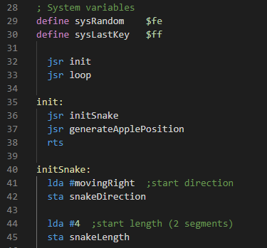

# Visual Studio Code 6502asm Assembler Language Support

This extension provides syntax highlighting for use with the [6502asm](http://www.6502asm.com) and [Easy 6502](http://skilldrick.github.io/easy6502) variant of 6502 assembly.

## Features

All 6502 opcodes are supported by the syntax highlighter, plus definitions specific to the 6502asm JavaScript family of assemblers (`define` and `dcb`)

Kind regards to [@tlgkccampbell](https://github.com/tlgkccampbell) for his work on the [code-ca65](https://github.com/tlgkccampbell/code-ca65) extension and [@skilldrick](https://github.com/skilldrick) for the [6502js](https://github.com/skilldrick/6502js) project.

## Release Notes

### 1.0.0

Initial release of vscode-6502asm.

### 1.1.0

Integration of 6502js assembler/emulator

